# Dados Abertos SUS{background-color="white"} 

Em [Portal de Dados Abertos dos SUS](https://dadosabertos.saude.gov.br), você encontra um site do Ministério da Saúde, no qual eles disponibilizam um tipo de subseção tema para cada banco.

{fig-align="center" width="40%"}

## Dados abertos SUS{background-color="white"}  
Acessando por item, por exemplo, indo em Arboviroses, se observam os seguintes dados:

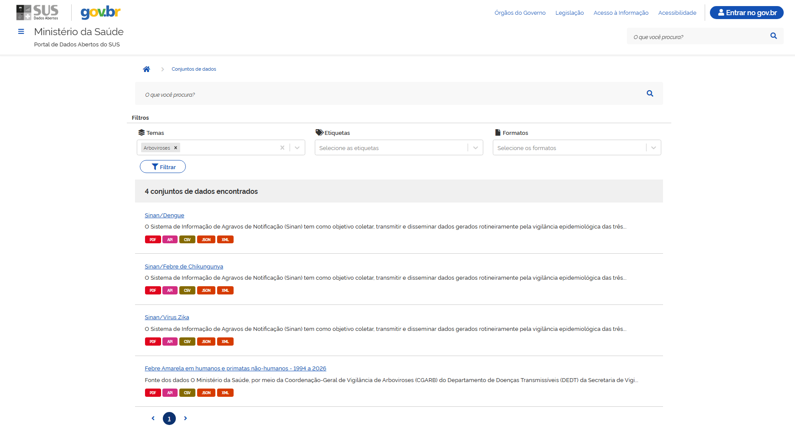{fig-align="center" width="80%"}

## Observando o Conjunto de Dados Disponibilizado{background-color="white"} 

Ao abrir um banco específico, você encontra primeiramente a descrição daquele banco:

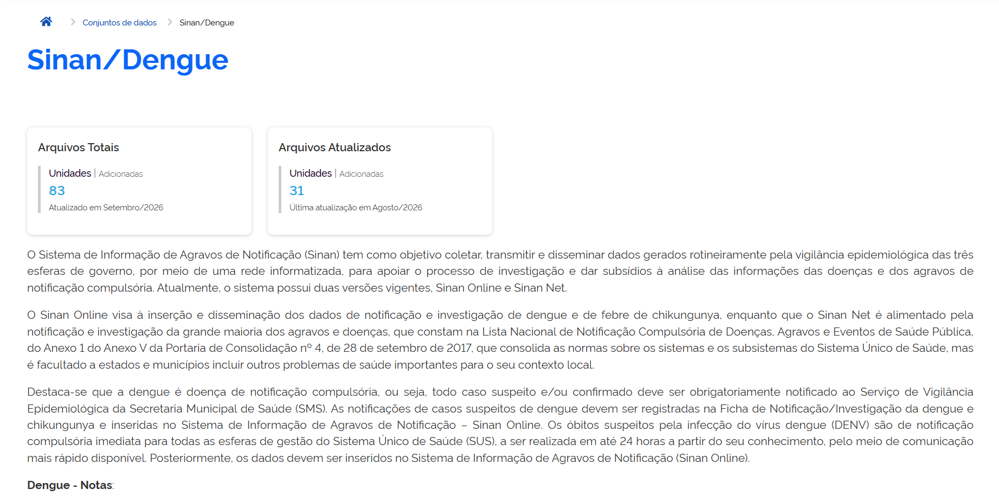{fig-align="center" width="20%"}

## Observando o Conjunto de Dados Disponibilizado{background-color="#191970"} 

Em seguida, se encontram algumas formas de baixar o conjunto de dados, no qual é disponibilizado nas seguintes extensões:

$\rightarrow$ API via Swagger[^1];

[^1]: Achei pouco intuitivo para obter os bancos.

$\rightarrow$ CSV;

$\rightarrow$ JSON;

$\rightarrow$ XML.

Além dos conjuntos de dados, você pode baixar **o dicionário de informações** sobre como estão identificadas cada coluna (variável) para análise no seu estudo.

# Ministério da Saúde - Outros Acessos{background-color="white"}  

Seguindo para o site [Ministério da Saúde - DATASUS](https://datasus.saude.gov.br), temos mais umas formas de tentar o acesso para os bancos de dados do SUS.
A primeira pelo **TABNET** e o segundo pelo **TABWIN.**

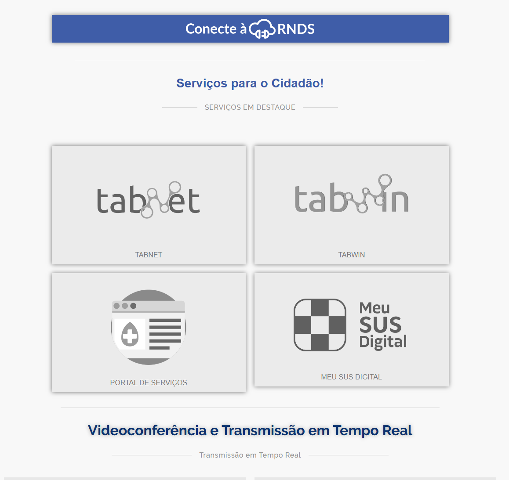{fig-align="center" width="40%"}

## TabNet - Layout{background-color="white"}  

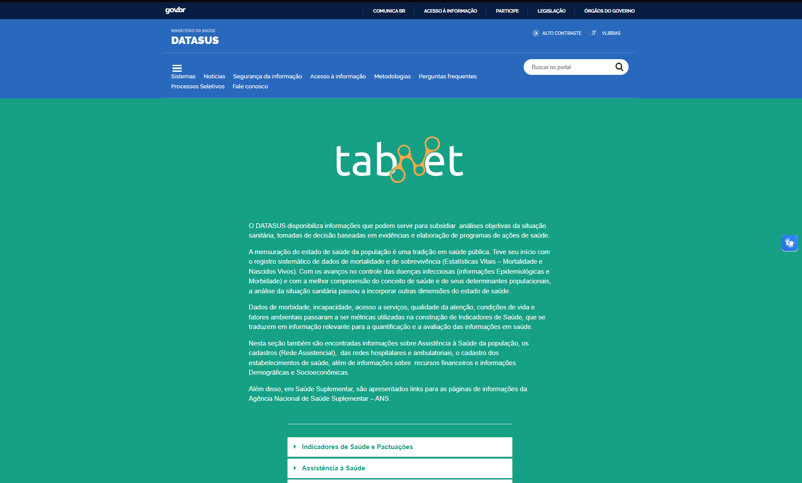{fig-align="center" width="40%"}

## TabNet - Áreas de Acesso para os Sistemas de Interesse{background-color="white"}  

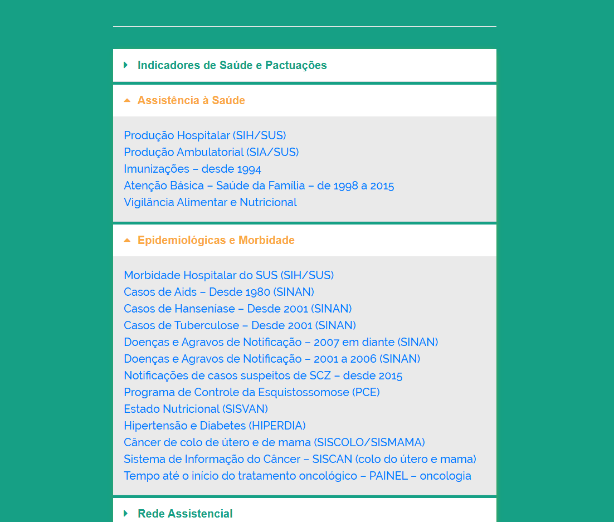{fig-align="center" width="40%"}

## TabNet - Filtrando os dados por doença/sistema de interesse{background-color="white"}  

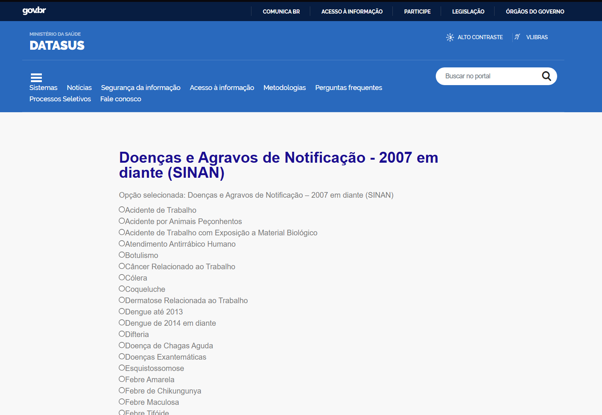{fig-align="center" width="40%"}

## TabNet - Filtrando Informações que se queira visualizar{background-color="white"}  

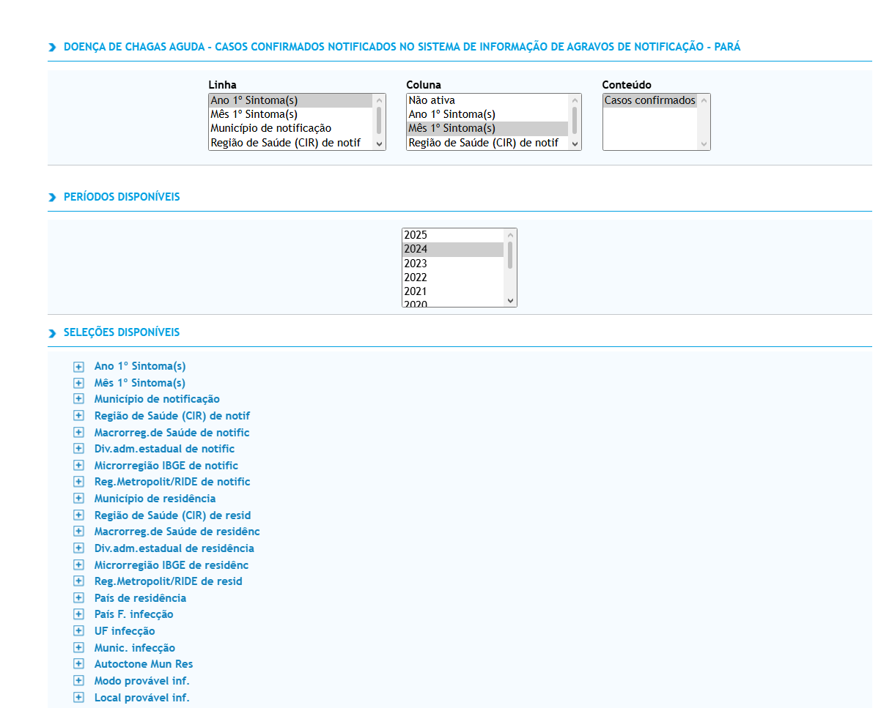{fig-align="center" width="40%"}

## TabNet - Resultado{background-color="white"}  

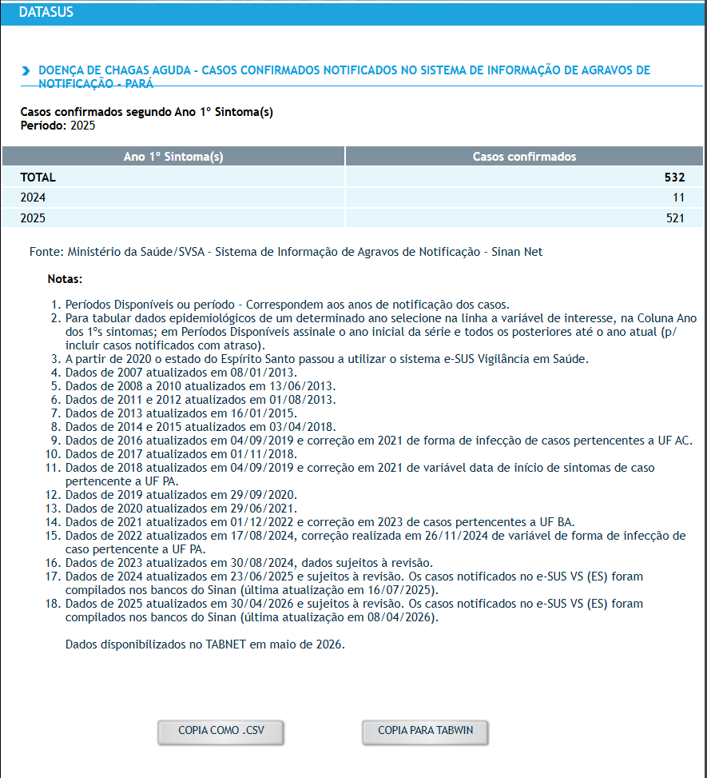{fig-align="center" width="40%"}

## Utilidade do TabNet{background-color="#191970"}  

Como se pode perceber, os dados são mais agregados, prontos para estatísticas ou informações rápidas para se checar, por exemplo, uma base a nível de indivíduo (dados microregionais), no intuito de chegar observações faltantes ou não, ou conferir se as informações batem.

## TabWin DATASUS - Ministério da Saúde{background-color="white"}  

O TabWin tem quase a mesma ideia do que foi proposto no pacote desenvolvido em `R`, de disponibilizar o acesso à vários sistemas disponíveis do SUS para obter os microdados (relevantes no caso de análises estatísticas e no proposto, análise de sobrevivência), só que ao aplicar as opções, e tentar abrir o arquivo que o sistema encontrou ou mesmo selecionar em download, não é possível baixar o arquivo diretamente.

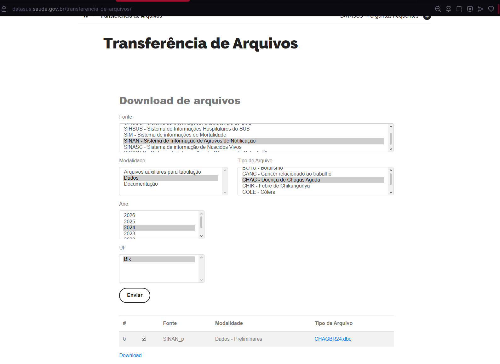{fig-align="center" width="40%"}

# [Dados via pacote `microdatasus` em `R`]{.underline}{background-color="#191970"} 

## Sobre o Pacote{background-color="white"} 

Segundo a descrição do próprio pacote:

> "O `microdatasus` baixa, lê e prepara microdados dos Sistemas de Informação em Saúde publicados pelo DataSUS. O pacote trabalha diretamente com arquivos DBC, seleciona os arquivos efetivamente disponíveis no servidor e oferece funções específicas para recodificar variáveis de SIM, SINASC, SIH, SIA, CNES e SINAN."[@saldanha2019microdatasus]

## Como baixar o pacote{background-color="#191970"}    

Para instalação do pacote, instale a última versão do `Rtools` compatível com o `R` instalado. 

::: columns
::: {.column width = "50%"}
```{r eval=FALSE, echo=TRUE}
#| fig-height: 5
#| fig-width: 5
# Dois pacotes que podem ser utilizados para puxar o pacote do github:

install.packages("devtools") 

install.packages("remotes") 

# Duas formas de instalar pacote:
  
remotes::install_github("rfsaldanha/microdatasus", ref = "dev")

devtools::install_github("rfsaldanha/microdatasus")
```
:::
::: {.column width = "50%"}
```{r eval=FALSE, echo=TRUE}
# Pacotes para manipulação e tratamento dos dados:
  
install.packages(c("RCurl", "dplyr", "stringr", "lubridate"))

# -> Você pode simplesmente carregar o pacote `tidyverse` também. 
  
# Carregando o pacote no documento:
  
library(microdatasus)

```
:::
:::
## Processando dados{background-color="white"} 

O pacote possui argumentos de acesso à alguns sistemas com palavras chaves para doenças ou tipos de monitoramento:


::: columns
::: {.column width = "50%"}
#### Para o SIH (Sistema de Informações Hospitalares) {.smaller}

`'SIH-RD','SIH-RJ','SIH-SP','SIH-ER'`

#### Para o SIM (Sistema de Informações sobre Mortalidade) {.smaller}

`'SIM-DO','SIM-DOFET','SIM-DOEXT','SIM-DOINF','SIM-DOMAT'`

#### Para o SINASC (Sistema de Informação sobre Nascidos Vivos) 

`'SINASC'`

#### CNES (Cadastro Nacional de Estabelecimentos de Saúde) {.smaller}

`'CNES-LT','CNES-ST','CNES-DC','CNES-EQ','CNES-SR','CNES-HB','CNES-PF','CNES-EP','CNES-RC','CNES-IN','CNES-EE','CNES-EF','CNES-GM'`
:::
::: {.column width = "50%"}
#### Para o SIA (Sistema de Informações Ambulatórias) {.smaller}

`'SIA-AB','SIA-ABO','SIA-ACF','SIA-AD','SIA-AN','SIA-AM','SIA-AQ','SIA-AR','SIA-ATD','SIA-PA','SIA-PS','SIA-SAD'`

#### Para o SINAN (Sistema de Informação de Agravos de Notificação) {.smaller}

`'SINAN-DENGUE','SINAN-CHIKUNGUNYA','SINAN-ZIKA','SINAN-MALARIA','SINAN-CHAGAS','SINAN-LEISHMANIOSE-VISCERAL','SINAN-LEISHMANIOSE-TEGUMENTAR','SINAN-LEPTOSPIROSE'`

:::
:::

## Como baixar os dados{background-color="#00008B"}
Após identificar o sistema que você irá baixar esses dados, o próximo passo consiste em selecionar o(s) ano(s) de observação, como exemplificado abaixo:

::: columns
::: {.column width = "60%"}

```{r eval=FALSE, echo=TRUE}
dados_brutos <- fetch_datasus(
  year_start = 2024,
  year_end = 2024,
  information_system = "SINAN-CHAGAS"
)

dados_processados <- process_sinan(dados_brutos, information_system = "SINAN-CHAGAS")

# OU

dados_processados <- process_sinan_chagas(dados_brutos)


```
:::
::: {.column width = "40%"}

#### Atenção !{.smaller}

Algumas bases mais que outras são pesadas de baixar. Em `fetch_datasus` ao verificar a documentação do pacote, eles sugerem utilizar o comando `uf` filtrando por estado(s), mas ao aplicar o comando, ele não existe para o sistema acessado, sendo baixado a base geral, nesse caso. Em outros sistemas pode ser que funcione, como se vê no próximo caso. 
:::
:::

## Exemplo: SINAN-CHAGAS{background-color="#00008B"}

Como citado no começo, se pode comparar as observações captadas do TabNet e os microdados obtidos:

::: columns
::: {.column width = "50%"}
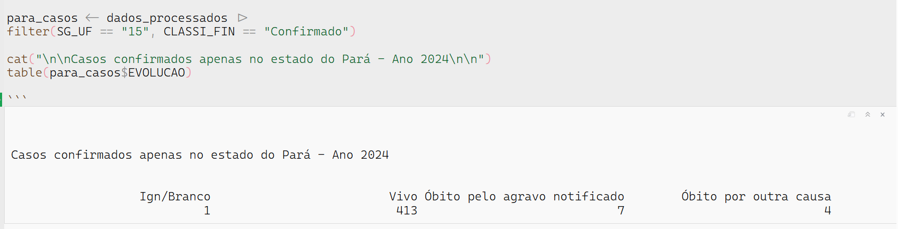{fig-align="center" width="95%"}

:::
::: {.column width = "50%"}

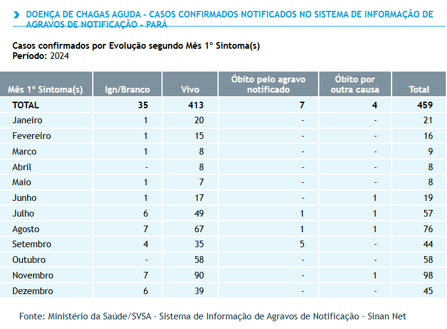{fig-align="center" width="80%"}

:::
:::
# [Dados via pacote `microdatasus` em `Python`]{.underline}{background-color="#191970"}

## Abordagem em `Python`{background-color="white"} 

Há também como acessar os dados do SUS no `python` através de duas abordagens: 

1. Instalar o ambiente `R` no `python` para baixar o banco de dados e depois trabalhar normalmente apenas em `python`.

2. Utilizar a biblioteca `pydatasus` ou `PySUS`, criados pela comunidade para acessar os dados da mesma forma que no pacote R[^2].

[^2]: Fazendo uma breve simulação deu alguns erros, e pelo que pude entender, essa abordagem não possui comandos de processamento como no `R`, logo os tratamentos serão apenas nos dados brutos. 

## Como utilizar no ambiente `python`{.smaller background-color="white"} 

```{r eval=FALSE, echo=TRUE}
# Carrega a extensão que permite usar o %%R nas células
%load_ext rpy2.ipython

# Instala o devtools e o microdatasus dentro do R
import rpy2.robjects as robjects
robjects.r('''
    if (!requireNamespace("devtools", quietly = TRUE)) install.packages("devtools")
    devtools::install_github("rfsaldanha/microdatasus")
''')
```

```{r eval=FALSE, echo=TRUE}
%%R
library(microdatasus)

# Baixa dados de exemplo (SIM - Sistema de Informação sobre Mortalidade)
dados <- fetch_datasus(year_start = 2021, year_end = 2021, uf = "RJ", information_system = "SIM-DO")
dados <- process_sim(dados)

head(dados)
```

```{r eval=FALSE, echo=TRUE}
%%R -o df_sim
# O parâmetro '-o df_sim' exporta o dataframe R 'df_sim' para o Python
df_sim <- dados

import pandas as pd

# O objeto df_sim já é um DataFrame do Pandas!
print(type(df_sim))
df_sim.head()
```


# Referências{background-color="#000080"}
