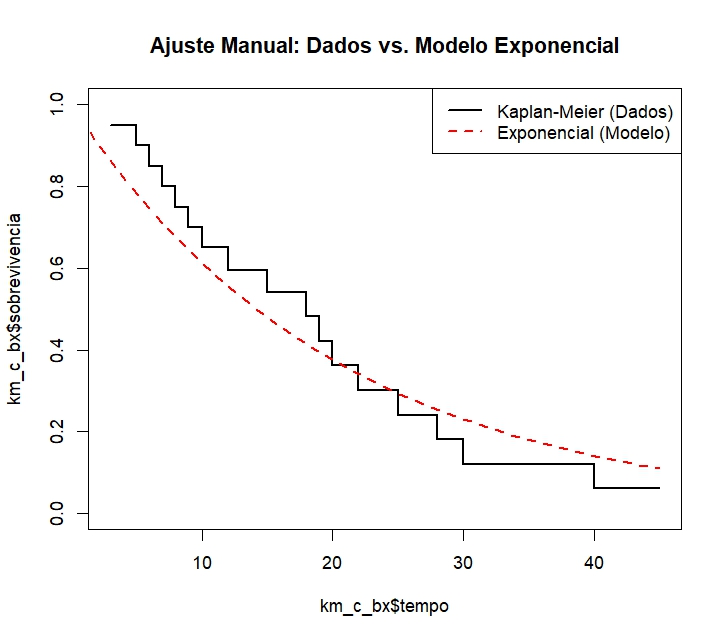
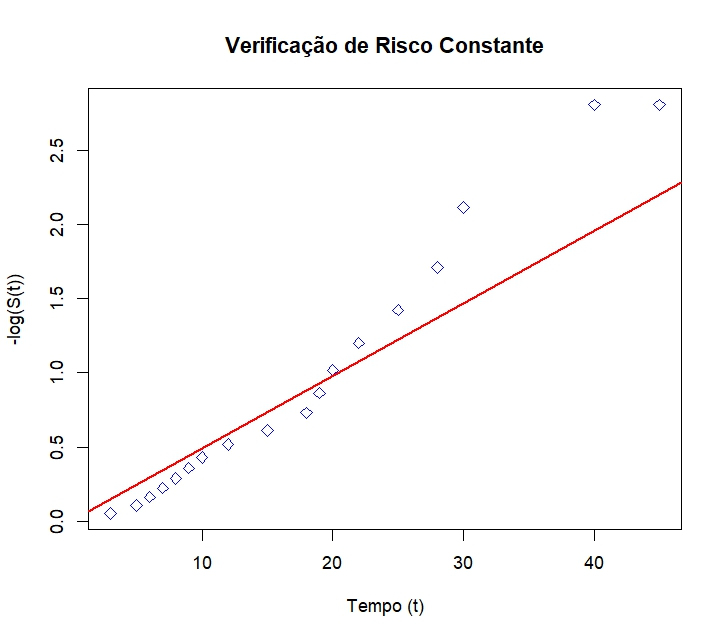

# Distribuição Exponencial

A função densidade de probabilidade associada a variável aleatória tempo até o evento $t$ com distribuição exponencial e função de sobrevivência é dada por:

$$
f(t) = \frac{1}{\alpha} \cdot exp\left[-\frac{t}{\alpha}\right] \ ; \ S(t)= exp\left[-\frac{t}{\alpha}\right]\ t > 0  
$$

Como o parâmetro $\alpha > 0$ correspondendo ao tempo médio de vida.

## Função de verossimilhança

$$
L(\theta | t) = \prod_{i=1}^{n} \left[\left(\frac{1}{\alpha} \cdot exp\left[-\frac{t}{\alpha}\right] \right)^{\delta_{i}} \cdot \left(exp\left[-\frac{t}{\alpha}\right]\right)^{1-\delta_{i}}\right]
$$

$$
= \prod_{i=1}^{n} \left[ \left( \frac{1}{\alpha} \right)^{\delta_{i}} \cdot \exp \left[ -\left( \frac{t_{i}}{\alpha} \right) \right]\right]
$$

## A Log-verossimilhança da exponencial

$$
\ell[L(\theta | t)] = \sum_{i=1}^n \left[ - \delta_i \log(\alpha) - \left( \frac{t_i}{\alpha} \right) \right]
$$

Derivando em relação a $\alpha$ teremos que:

$$
\frac{\partial l[L(\hat{\theta}|t_{i})]}{\partial\alpha} = \frac{-\sum_{i=1}^{n}\cdot\delta_{i}}{\alpha} + \frac{\sum_{i=1}^{n}t_{i}}{\alpha^{2}} = 0
$$

$$
\frac{-\sum_{i=1}^{n}\cdot\delta_{i}}{\alpha} + \frac{\sum_{i=1}^{n}t_{i}}{\alpha^{2}} = 0 \ \cdot (\alpha^{2}) 
$$

$$
= -\sum_{i=1}^{n}\cdot\delta_{i}\cdot \alpha + \sum_{i=1}^{n}t_{i} = 0 
$$

$$
\sum_{i=1}^{n} t_{i} = \sum_{i=1}^{n} \cdot \delta_{i} \cdot \alpha 
$$

$$
\hat{\alpha} = \frac{\sum_{i=1}^{n}t_{i}}{\sum_{i=1}^{n}\cdot\delta_{i}}
$$

Na ausência de censura, aplicando $\delta_{i}={1}$, teremos:

$$
\hat{\alpha} = \frac{\sum_{i=1}^{n}t_{i}}{n}
$$

Que é exatamente a média amostral de $t_{i}$.

## Sobre o modelo

O modelo mais simples, caracterizado pela ausência de memória. Sendo aplicado em situações onde a falha ocorre de forma aleatória e estável, limitado para casos em que se quer obter o envelhecimento ou desgaste.

## Linearização da função de sobrevivência

> "Para comparar o comportamento do modelo com os dados utilizados, se pode aplicar a linearização da função de sobrevivência de cada modelo construindo gráficos que sejam aproximadamente lineares, caso o modelo seja apropiado. Violação de lienaridade pode ser verificada visualmente de forma rápida."

### Linarização da função de sobrevivência exponencial

Para o modelo exponencial, a função de sobre vivência é dada por

$$
S(t)= exp\left[-\frac{t}{\alpha}\right]
$$

Logo,

$$-\log[S(t)] = \frac{t}{\alpha} = \left(\frac{1}{\alpha}\right)t$$

corresponde à equação da reta $y = a+bx$, $y=-log[S(t)]$, $a=0$, $b=1/\alpha$ e $x= t$. Sendo o modelo apropriado no caso $y$ versus t deve aproximadamente linear passando pela origem, com $\hat{S}(t)$ correspodendo ao estimador de Kaplan-Meier.

{fig-align="center"}

{fig-align="center"}

No gráfico de verificação de risco ou linenaridade, se observa o risco acumulado versus o tempo. Se o risco fosse constante para o modelo Exponencial, os pontos deveriam formar uma linha reta partindo da origem. No caso, entretanto, os pontos formam uma curva para cima, indicando que o risco de o evento ocorrer aumenta com o tempo (risco de desenvolver câncer de bexiga). No início, o risco é vagaroso (tempo 0 a 15), após o tempo 20, a inclinação aumenta bruscamente.

```{r eval=FALSE, include=FALSE}


# Verificando como os dados do livro: câncer de bexiga

# Ajuste conforme a distribuição

ajust1_cc_bx <- survreg(Surv(tempos,cens)~1,dist = "exponential")
ajust2_cc_bx <- survreg(Surv(tempos,cens)~1,dist = "weibull")
ajust3_cc_bx <- survreg(Surv(tempos,cens)~1,dist = "lognorm")
# Ekm  dos dados

ekm_cc_bx <- survfit(Surv(tempos,cens)~1)
time <- ekm_cc_bx$time
st <- ekm_cc_bx$surv

# Cálculo dos parâmetros estimados das distribuições

alpha<- round(exp(ajust1_cc_bx$coefficients[1]),2 )
alpha2<-  round(exp(ajust2_cc_bx$coefficients[1]),2 )
gama2<-1/ajust2_cc_bx$scale

mi <-  round(ajust3_cc_bx$coefficients[1],2)
alpha3 <- round(ajust3_cc_bx$scale,2)

ste_cc_bx<-exp(-time/alpha)

stw_cc_bx<- exp(-(time/alpha2)^gama2)

stln_cc_bx<- pnorm((-log(time)+ mi)/alpha3)

par(mfrow=c(1,3))
 plot(st, ste_cc_bx, pch=16, ylim=c(0,1), xlim=c(0,1), 
      xlab = "S(t): Kaplan-Meier", ylab="S(t): exponencial",
      cex.lab=1.5,cex.axis=1.3)
 abline(a=0,b=1)

 plot(st, stw_cc_bx, pch=16, ylim=c(0,1), xlim=c(0,1), 
      xlab = "S(t): Kaplan-Meier", ylab="S(t): weibull",
      cex.lab=1.5,cex.axis=1.3)
 abline(a=0,b=1)

 plot(st, stln_cc_bx, pch=16, ylim=c(0,1), xlim=c(0,1), 
      xlab = "S(t): Kaplan-Meier", ylab="S(t): log-normal",
      cex.lab=1.5,cex.axis=1.3)
 abline(a=0,b=1)

par(mfrow=c(1,3),mar=c(5,5,2,2)); 
invst<-qnorm(st) 
plot(time,-log(st),pch=16,xlab="Tempo",ylab="-log(S(t))") 
plot(log(time),log(-log(st)),pch=16,xlab="log(Tempo)",ylab="log(-log(S(t)))") 
plot(log(time),invst,pch=16,xlab="log(Tempo)",ylab=expression(Phi^-1*(S(t))))

par(mfrow=c(1,2)) 
plot(ekm_cc_bx,conf.int=F,xlab="Tempo",ylab="S(t)"); lines(c(0,time),c(1,stw_cc_bx),lty=2) 
legend(25,0.8,lty=c(1,2),c("Kaplan-Meier","Weibull"),bty="n",cex=0.9) 
plot(ekm_cc_bx,conf.int=F,xlab="Tempo",ylab="S(t)"); lines(c(0,time),c(1,stln_cc_bx),lty=2) 
legend(25,0.8,lty=c(1,2),c("Kaplan-Meier","Log-normal"),bty="n",cex=0.9)


```
