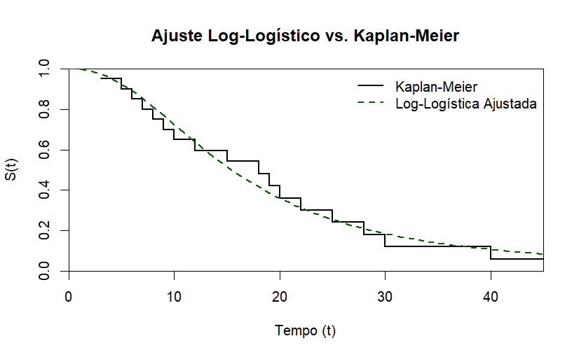
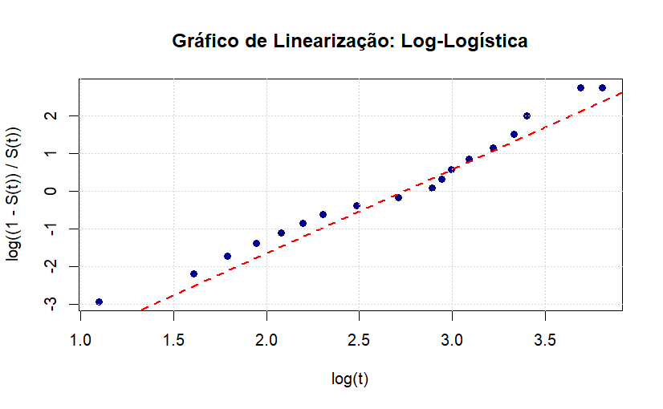

# Distribuição Log-logística

A função densidade de probabilidade associada a variável aleatória tempo até o evento $T$ com distribuição log-logística é dada por:

$$
f(t) = \frac{\gamma}{\alpha^{\gamma}} \cdot t^{(\gamma-1)} \left[ 1 + \left(\frac{t}{\alpha} \right)^\gamma \right]^{-2}
$$

## Função de Sobrevivência

$$
S(t) = \frac{1}{1 + \left(\frac{t}{\alpha} \right)^\gamma}
$$

## Função verossimilhança

$$
L(\theta | t) = \prod_{i=1}^{n} \left[ \left( \frac{\gamma}{\alpha^\gamma} \cdot t_i^{\gamma-1} \left[ 1 + \left( \frac{t_i}{\alpha} \right)^\gamma \right]^{-2} \right)^{\delta_i} \cdot \left( \frac{1}{1 + \left( \frac{t_i}{\alpha} \right)^\gamma} \right)^{1-\delta_i} \right]
$$

$$
\ell[L(\theta | t)] = \sum_{i=1}^{n} \left[ \delta_i \log \left( \frac{\gamma}{\alpha^\gamma} \cdot t_i^{\gamma-1} \left[ 1 + \left( \frac{t_i}{\alpha} \right)^\gamma \right]^{-2} \right) +  (1-\delta_i) \log \left( \frac{1}{1 + \left( \frac{t_i}{\alpha} \right)^\gamma} \right) \right]
$$

$$
= \sum_{i=1}^{n} \left[ \delta_i \left( \log(\gamma) - \gamma \log(\alpha) + (\gamma-1) \log(t_i) - 2 \log \left( 1 + \left( \frac{t_i}{\alpha} \right)^\gamma \right) \right) + \\[10pt] (1-\delta_i) \log \left( \frac{1}{1 + \left( \frac{t_i}{\alpha} \right)^\gamma} \right) \right]
$$

Aplicando uma expansão dos termos nas duas últimas partes da expressão, se pode simplificar da seguinte forma:

$$
= -2 \delta_i \log \left( 1 + \left( \frac{t_i}{\alpha} \right)^\gamma \right) + \log \left( \frac{1}{1 + \left( \frac{t_i}{\alpha} \right)^\gamma} \right) - \delta_i \log \left( \frac{1}{1 + \left( \frac{t_i}{\alpha} \right)^\gamma} \right)
$$

$$
= -2\delta_i \log \left( 1 + \left( \frac{t_i}{\alpha} \right)^\gamma \right) + \log \left( \frac{1}{1 + \left( \frac{t_i}{\alpha} \right)^\gamma} \right) + \delta_i \log \left( 1 + \left( \frac{t_i}{\alpha} \right)^\gamma \right)
$$

Logo, a expressão final:

$$
\\[10pt]
= \sum_{i=1}^{n} \left[ \delta_i \left[ \log(\gamma) - \gamma \log(\alpha) + (\gamma-1) \log(t_i) - \log \left( 1 + \left( \frac{t_i}{\alpha} \right)^\gamma \right) + \log \left( \frac{1}{1 + \left( \frac{t_i}{\alpha} \right)^\gamma} \right) \right] \right]
$$

## Aplicação

```{r}

S_loglogistica <- function(theta, t, delta) {
  
  alpha <- exp(theta[1])
  gamma <- exp(theta[2])
  
  log_f <- log(gamma) - (gamma * log(alpha)) + (gamma - 1) * log(t) - 2 * log(1 + (t/alpha)^gamma)
  
  log_S <- -log(1 + (t/alpha)^gamma)
  
  LOG_L <- sum(delta * log_f + (1 - delta) * log_S)
  
  return(-LOG_L)
}
inicio <- c(log(mean(tempos)), 0)

fit_ll <- optim(par = inicio, fn = S_loglogistica, t = tempos, 
                delta = cens, method = "BFGS")
```

Aplicando o $optim$ se obtem os valores estimados dos parâmetros: \[ 2.7373688, 0.7993457\] e estatística de 66.03053.

```{r}

# Parte refeita

# 1. Extração correta dos parâmetros 
#(voltando para a escala original)

alpha_est <- exp(fit_ll$par[1])
gamma_est <- exp(fit_ll$par[2])

# Sequência de tempo começando do zero para o gráfico encostar no eixo Y
t_seq <- seq(0, max(tempos, na.rm = TRUE), length.out = 100)

# Calcular a sobrevivência teórica
s_loglogis <- 1 / (1 + (t_seq / alpha_est)^gamma_est)

indices_lin <- which(km_c_bx$sobrevivencia > 0 & km_c_bx$sobrevivencia < 1)
t_km <- km_c_bx$tempo[indices_lin]
s_km <- km_c_bx$sobrevivencia[indices_lin]

y_lin <- log((1 - s_km) / s_km)
x_lin <- log(t_km)

indices_lin <- which(km_c_bx$sobrevivencia > 0 & km_c_bx$sobrevivencia < 1)
t_km <- km_c_bx$tempo[indices_lin]
s_km <- km_c_bx$sobrevivencia[indices_lin]

# 2. Definir as coordenadas de linearização
y_lin <- log((1 - s_km) / s_km)
x_lin <- log(t_km)
```

{fig-align="center" width="90%"}

{fig-align="center" width="90%"}
