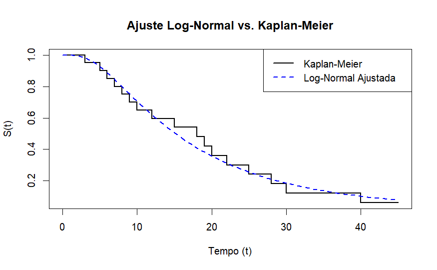
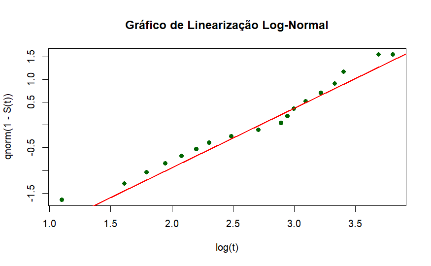

# Distribuição Log-normal

A função densidade de probabilidade associada a variável aleatória tempo até o evento $T$ com distribuição log-normal e função de sobrevivência é dada por:

$$
f(t) = \frac{1}{\sqrt{2\pi} \cdot t \cdot \sigma} \cdot exp\left[ \frac{1}{2\sigma^{2}} \cdot (\log(t) - \mu)^{2} \right] \ ; \ S(t)= \Phi \left(\frac{-\log(t) + \mu}{\sigma} \right) t > 0
$$

## Função de verossimilhança

$$
L(\theta | t) = \prod_{i=1}^n \left[ \left( (2\pi)^{-1/2} \cdot t^{-1} \cdot \sigma^{-1} \cdot \exp \left[ -\frac{1}{2\sigma^2} (\log(t) - \mu)^2 \right] \right)^{\delta_i} \cdot \left( \Phi \left( \frac{-\log(t) + \mu}{\sigma} \right) \right)^{1-\delta_i} \right]
$$

## Log-verossimilhança da Log-Normal:

$$
\ell[L(\theta | t)] = \sum_{i=1}^n \left[ \delta_i \log \left( (2\pi)^{-1/2} \cdot t_i^{-1} \cdot \sigma^{-1} \cdot \exp \left[ -\frac{1}{2\sigma^2} (\log(t_i) - \mu)^2 \right] \right) + (1-\delta_i) \log \left( \Phi \left( \frac{-\log(t_i) + \mu}{\sigma} \right) \right) \right]
$$

$$
= \sum_{i=1}^n \left[ \delta_i \left[ -\frac{1}{2} \log(2\pi) - \log(t_i) - \log(\sigma) - \frac{1}{2\sigma^2} (\log(t_i) - \mu)^2 \right] + (1-\delta_i) \log \left( \Phi \left( \frac{-\log(t_i) + \mu}{\sigma} \right) \right) \right]
$$

## Lineiarização da função de sobrevivência da log-normal

A função de sobrevivência associada ao modelo log-normal, dada por

$$
S(t)= \Phi \left(\frac{-\log(t) + \mu}{\sigma} \right)
$$

também pode ser linearizada e apresentada a seguinte forma

$$
\Phi^{-1}(S(t)) = \frac{-\log(t) + \mu}{\sigma} = \frac{\mu}{\sigma} - \left(\frac{1}{\sigma}\right)\log(t)
$$

com $\Phi^{-1}(.)$ correspondendo aos percentis da distribuição normal padrão.

Portanto para que o modelo log-normal seja considerado apropriado, o gráfico $\Phi^{-1}(\hat{S}(t))$ *versus* $\log(t)$ deve ser aproximadamente linear com intercepto $a=\mu/\sigma$, e inclinação $b = -1/\sigma$.

## Aplicação: Pacientes com câncer de bexiga

1º Função de log-verossimilhança

```{r}
#| eval: false

# Refeita

log_vero_surv_lnorm <- function(theta,t,status){
  mu    <- theta[1]
  sigma <- theta[2]
  log_S <- plnorm(t, meanlog = mu, sdlog = sigma, lower.tail = FALSE, log.p = TRUE)
  
  log_f <- -0.5*log(2*pi) - log(t) - log(sigma) - (1/(2*sigma^2)) * (log(t) - mu)^2
  
  L_LOG <- sum(status * log_f + (1 - status) * log_S)
  
  return(-L_LOG)

}
```

2º Obtendo os parâmetros estimados pelo modelo

```{r}
#| eval: false

ajust2 <- optim(par=c(1,1),f=log_vero_surv_lnorm,
                   t = tempos,
                   status = cens
                , hessian = T)
```

O valor $par = \left\{\hat{\mu};\hat{\sigma}\right\}$ é de $\hat{\mu} = 2.717182$ e $\hat{\sigma} =0.764918$ sendo o valor da estatistica da log-verrossimilhança para o modelo de 65.7399.

3º Comparação gráfica entre a curva de sobrevivência teórica e a curva KM.
Bem como observar o comportamento dos dados, ao modelo.

```{r}
#| eval: false

mu_est <- ajust2$par[1]
sigma_est <- ajust2$par[2]


indices <- which(km_c_bx$sobrevivencia > 0) 
t_km <- km_c_bx$tempo[indices]
s_km <- km_c_bx$sobrevivencia[indices]

t_plot <- c(0, t_km)
s_plot <- c(1, s_km)


t_teorico <- seq(0, max(t_plot),length.out=100)
s_lnorm <- pnorm((log(t_teorico) - mu_est) / sigma_est, 
                 lower.tail = FALSE)

y_coord <- qnorm(1 - s_km)
x_coord <- log(t_km)

```

{fig-align="center" width="90%"}

{fig-align="center" width="90%"}
