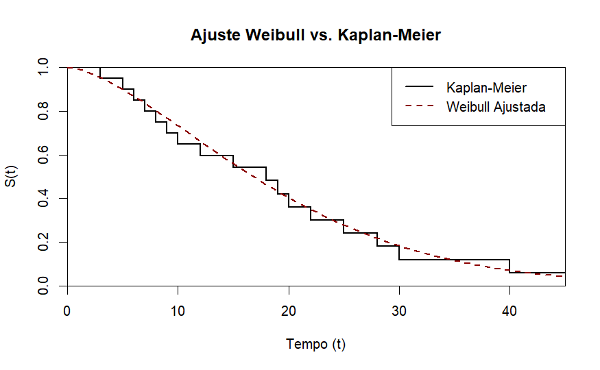
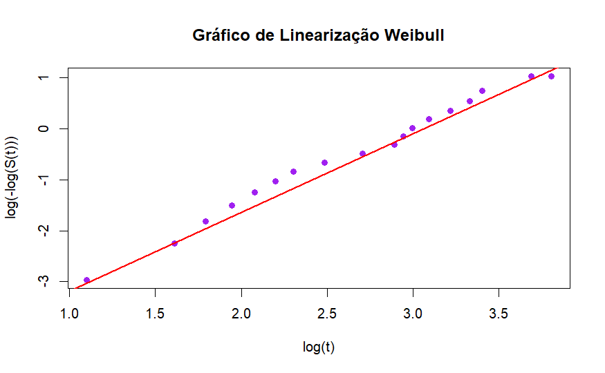

# Distribuição Weibull

A função densidade de probabilidade associada a variável aleatória tempo até o evento $t$, possui uma grande variedade de formas, sendo sua função densidade, possuindo uma propriedade básica: a função taxa de falha sendo monótona, ou seja, crescente, decrescente ou constante.

Com distribuição Weibull é dada por:

$$
f(t) = \frac{\gamma}{\alpha^{\gamma}}\cdot t^{(\gamma-1)} \cdot exp\left[-\left(\frac{t}{\alpha}\right)^{\gamma} \right], \ t>0 
$$

E função de sobrevivência dada por:\
$$
S(t) = exp\left[ - \left(\frac{t_{i}}{\alpha}\right)^{\gamma}\right]
$$

Os parâmetros de escala e forma, $\alpha$ e $\gamma$ são positivos.
O parâmetro $\alpha$ tem mesma medida de unidade de $t$ e $\gamma$ não tendo unidade de medida.

## Função de verossimilhança é dada por:

$$
L(\theta | t) = \prod_{i=1}^{n} \left[ \left( \frac{\gamma}{\alpha^{\gamma}} \cdot t_{i}^{\gamma-1} \cdot \exp\left[ -\left( \frac{t_{i}}{\alpha} \right)^{\gamma} \right] \right)^{\delta_{i}} \cdot \left( \exp\left[ -\left( \frac{t_{i}}{\alpha} \right)^{\gamma} \right] \right)^{1-\delta_{i}} \right]
$$

## Log-verossimilhança da Weibull:

$$
\ell[L(\theta | t)] = \sum_{i=1}^{n} \left[ \delta_{i} \log \left( \frac{\gamma}{\alpha^{\gamma}} \cdot t_{i}^{\gamma-1} \right) - \left( \frac{t_{i}}{\alpha} \right)^{\gamma} \right]
$$

$$
\ell[L(\theta | t)] = \sum_{i=1}^{n} \left[ \delta_{i} \left[ \log(\gamma) - \gamma \log(\alpha) + (\gamma - 1) \log(t_{i}) \right] - \left( \frac{t_{i}}{\alpha} \right)^{\gamma} \right]
$$

## Distribuição Log-Weibull (Gumbel)

$$L(\theta | y) = \prod_{i=1}^n \left[ \left( \frac{1}{\sigma} \exp \left[ \frac{y_i - \mu}{\sigma} - \exp \left( \frac{y_i - \mu}{\sigma} \right) \right] \right)^{\delta_i} \cdot \left( \exp \left[ -\exp \left( \frac{y_i - \mu}{\sigma} \right) \right] \right)^{1-\delta_i} \right]$$

$$\ell[L(\theta|y)] = \sum_{i=0}^{n}\left[\delta_{i} \log\left(\frac{1}{\sigma} \exp \left[ \frac{y_i - \mu}{\sigma} - \exp \left( \frac{y_i - \mu}{\sigma} \right) \right] \right) + (1-\delta_i) \log \left( \exp \left[ -\exp \left( \frac{y_i - \mu}{\sigma} \right) \right] \right)\right]$$

Desenvolvendo as exponencias, aplicando os logs e separando os termos multiplicados na segunda parte da equação por $1-\delta_{i}$.

$$-\delta_{i} \exp \left[ \frac{y_i - \mu}{\sigma} \right] - \exp \left[\frac{y_{i} - \mu}{\sigma} \right]+ \delta{i} \exp \left[\frac{y_{i} - \mu}{\sigma} \right]$$

$$\ell[L(\theta | y)] = \sum_{i=1}^n \left[ \delta_i \left[ -\log(\sigma) + \left( \frac{y_i - \mu}{\sigma} \right) \right] - \exp \left( \frac{y_i - \mu}{\sigma} \right) \right]$$

## Linearização da função de sobrevivência da Weibull

A função de sobrevivência do modelo de Weibull é dado por

$$
S(t) = \exp\left[- \frac{t}{\alpha}^{\lambda} \right]
$$

Desse modo,

$$
-\log\left[S(t)\right] = \left( \frac{t}{\alpha}^{\lambda}\right)
$$

tal que, de acordo com a equação $y= a +bx$, se tem $y=\log\left[-\log\left[S(t)\right]\right]$, $a = -\lambda\log(\alpha)$, $b=\lambda$, $x=\log(t)$.
Portanto, para que o modelo de Weibull seja considerado apropriado, gráfico $\log\left[-\log\left[S(t)\right]\right]$ *versus* $\log(t)$ deve ser aproximadamente linear, com $\hat{S}(t)$ correspondendo ao estimador de Kaplan-Meier.
Se além de linear, apresentar inclinação igual a 1, haverá evidências a favor do modelo exponencial.

## Aplicação

```{r}
#| eval: false
log_vero_surv_weibull_R <- function(theta, t, status) {
  alpha <- theta[1]
  gamma <- theta[2]
  
  # Evita valores não positivos para os parâmetros durante a otimização
  if (alpha <= 0 || gamma <= 0) return(1e10)
  
  # log(f(t)): log-densidade para os eventos (status == 1)
  log_f <- dweibull(t, shape = gamma, scale = alpha, log = TRUE)
  
  # log(S(t)): log-sobrevivência para as censuras (status == 0)
  # lower.tail = FALSE retorna P(X > x), e log.p = TRUE retorna o log disso
  log_S <- pweibull(t, shape = gamma, scale = alpha, lower.tail = FALSE, log.p = TRUE)
  
  # Soma ponderada pelo status:
  # Se status=1, contribui log_f. Se status=0, contribui log_S.
  Log_L <- sum(status * log_f + (1 - status) * log_S)
  
  if (!is.finite(Log_L)) return(1e10)
  
  return(-Log_L) # Retorna negativo para minimizar
}
ajust3 <- optim(par = c(1, 1), log_vero_surv_weibull_R,
                t = tempos, status = cens,
                method = "BFGS",hessian = T)
```

```{r}
#| eval: false
 
# plot 1

indices <- which(km_c_bx$sobrevivencia > 0) 
t_km <- km_c_bx$tempo[indices]
s_km <- km_c_bx$sobrevivencia[indices]

t_plot <- c(0, t_km)
s_plot <- c(1, s_km)

alpha_est <- ajust3$par[1]
gamma_est <- ajust3$par[2]
t_seq <- seq(0, max(t_plot), length.out = 100)
s_weibull <- pweibull(t_seq, shape = gamma_est, scale = alpha_est, lower.tail = FALSE)

#plot 2

# 2. Transformações lineares

y_weibull <- log(-log(s_km))
x_weibull <- log(t_km)

```

{fig-align="center" width="90%"}

{fig-align="center" width="90%"}
